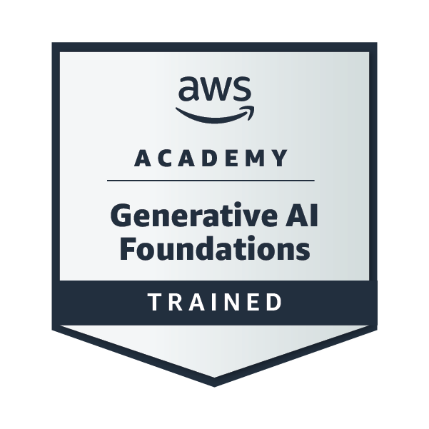

# 👨‍💻 Udhayakumar P
Cyber Security | VAPT | Cloud Security | Web Application Security | IoT Security

---

## 🧑‍💻 About Me

Pre-Final Year **B.E – CSE (Cybersecurity)** student at **SSM Institute of Engineering and Technology (SSMIET)** with hands-on learning in **Vulnerability Assessment and Penetration Testing (VAPT)**, threat analysis, and secure system design.

Currently exploring **Cloud Security architectures, Web Application vulnerabilities (OWASP Top 10), and IoT security monitoring** to understand and mitigate real-world cyber threats.

---

# 🤝 Connect With Me

---

# 💻 Languages

---

# 🛠️ Development Tools

---

# 🔐 Cyber Security Tools

---

# 🖥️ Operating Systems

---

# 🚀 Projects

### 🔹 AI Translator
**Problem:** Language barriers limit communication between users worldwide.  
**Solution:** Developed a Python-based AI translator using Googletrans API supporting **100+ languages with real-time detection and translation**.

---

### 🔹 IoT Classroom Incubator System
**Problem:** Classrooms lack automated monitoring for environmental conditions.  
**Solution:** Built an **ESP32-based IoT monitoring system** using PIR and DHT22 sensors with a **real-time web dashboard** for remote monitoring and control.

---

### 🔹 Industrial IoT Cyberattack Monitoring System
**Problem:** Industrial IoT networks are vulnerable to cyber attacks targeting sensor systems.  
**Solution:** Designed a **secure IIoT monitoring platform using blockchain and TinyML anomaly detection** to detect attacks and trigger alerts within seconds.

---

### 🔹 Fraud Email & SMS Detection
**Problem:** Phishing emails and scam messages expose users to financial fraud.  
**Solution:** Developed an **AI-based classification system** that detects phishing messages and labels them as **Safe, Suspicious, or Malicious**.

---

# 🏆 Achievements

🥉 **3rd Prize – HackElite Hackathon**  
SRM Institute of Science and Technology – Vadapalani

---

# 🎖 Certifications

### Certified Cybersecurity Educator Professional (CCEP)

Issued by **Red Team Leaders – November 2025**

---

### Palo Alto Networks – Security Operations Fundamentals

Completed **March 3, 2026**

---

### AWS Academy Graduate – Generative AI Foundations

---

### Cisco Networking Academy

Introduction to Cybersecurity  
Introduction to Internet of Things  
Networking Basics

---

# 🎓 Education

**B.E – Computer Science and Engineering (Cybersecurity)**  
SSM Institute of Engineering and Technology  
2023 – 2027

---

# 📊 GitHub Activity

---
⭐ Exploring cybersecurity, building secure systems, and continuously learning to defend against modern cyber threats.
